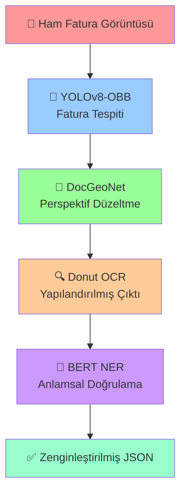

<div align="center">
  
# 🧾 OCR VE NER İLE FATURALARIN SINIFLANDIRILMASI

<p align="center">
  
</p>

### 📱 Yapay Zeka Destekli Fatura İşleme ve Sınıflandırma Sistemi

<p align="center">
  
  
  
</p>

---

## 🌟 Proje Hakkında

Bu proje, modern yapay zeka teknolojilerini kullanarak fatura görüntülerinden otomatik veri çıkarımı ve sınıflandırma işlemini gerçekleştiren kapsamlı bir sistemdir. YOLOv8-OBB, DocGeoNet, Donut ve BERT NER modelleri ile güçlendirilmiş AI pipeline'ı sayesinde faturalardan yüksek doğrulukla yapılandırılmış veri elde edilmektedir.

</div>

---

## 👥 Proje Ekibi

<table align="center">
  <tr>
    <td align="center">
      
      <br>
      <b>DOÇ. DR. AYŞE BERNA ALTINEL GİRGİN</b>
      <br>
      <sub>Akademik Danışman</sub>
    </td>
  </tr>
</table>

<table align="center">
  <tr>
    <td align="center" width="200">
      
      <br>
      <b>AHMED SAID KILIÇ</b>
      <br>
      <sub>AI & MLOps Lead</sub>
    </td>
    <td align="center" width="200">
      
      <br>
      <b>ISMAIL MERT AKPINAR</b>
      <br>
      <sub>.NET Backend Developer</sub>
    </td>
    <td align="center" width="200">
      
      <br>
      <b>GURKAN ÇELEN</b>
      <br>
      <sub>DevOps & System Integration</sub>
    </td>
    <td align="center" width="200">
      
      <br>
      <b>YUNUS ALP TURAN</b>
      <br>
      <sub>Mobile Developer & Documentation</sub>
    </td>
  </tr>
</table>

---

## 🏗️ Teknoloji Yığını

### 🖥️ Backend Teknolojileri
<p align="center">
  
  
  
  
</p>

### 🤖 Yapay Zeka & ML
<p align="center">
  
  
  
  
</p>

### 📱 Mobil Geliştirme
<p align="center">
  
  
  
</p>

### 🔧 DevOps & Altyapı
<p align="center">
  
  
  
  
</p>

### 📚 Kütüphaneler & Framework'ler
<p align="center">
  
  
  
  
  
</p>

---

## 🚀 Sistem Mimarisi

<div align="center">

### 🔄 Yapay Zeka İşlem Hattı



</div>

### ⚡ Performans Metrikleri

<table align="center">
  <tr>
    <th>🎯 Model</th>
    <th>📊 F1 Skoru</th>
    <th>⏱️ İşlem Süresi</th>
    <th>🎯 Katkı</th>
  </tr>
  <tr>
    <td>YOLOv8-OBB</td>
    <td>-</td>
    <td>0.14 saniye</td>
    <td>Fatura tespiti ve kırpma</td>
  </tr>
  <tr>
    <td>DocGeoNet</td>
    <td>+%8 artış</td>
    <td>5.22 saniye</td>
    <td>Perspektif düzeltme</td>
  </tr>
  <tr>
    <td>Donut (CORD v2)</td>
    <td>91.3%</td>
    <td>1.08 saniye</td>
    <td>OCR ve yapılandırma</td>
  </tr>
  <tr>
    <td>BERT NER</td>
    <td>+%3 artış</td>
    <td>-</td>
    <td>Anlamsal doğrulama</td>
  </tr>
  <tr>
    <td><b>Toplam Sistem</b></td>
    <td><b>94.3%</b></td>
    <td><b>6.81 saniye</b></td>
    <td><b>End-to-end işlem</b></td>
  </tr>
</table>

---

## 🛠️ Teknik Özellikler

### 🔐 Kimlik Doğrulama & Güvenlik
- **JWT Authentication**: Modern ve güvenli token tabanlı kimlik doğrulama
- **Oturum Yönetimi**: Sunucu tarafında oturum tutulmaz, stateless mimari
- **Claim-based Authorization**: Kullanıcı rolleri ve yetkiler token içinde

### 📅 Otomasyon & Zamanlama
- **Hangfire Integration**: Zamanlanmış görevler için güçlü iş zamanlayıcı
- **Aylık Raporlama**: Her ayın 1'inde otomatik e-posta raporları
- **Hata Toleransı**: Başarısız işlemler için otomatik yeniden deneme

### 📧 İletişim Sistemi
- **SMTP Mail Service**: HTML formatında dinamik e-posta gönderimi
- **Template System**: Kişiselleştirilebilir e-posta şablonları
- **Gmail Integration**: Gmail SMTP sunucusu entegrasyonu

### 📱 Mobil Uygulama Özellikleri
- **Cross-Platform**: Android ve iOS desteği
- **Camera Integration**: Kamera ile fatura tarama
- **Gallery Support**: Galeriden görüntü seçme
- **Real-time Processing**: Anlık OCR/NER işlemi
- **Responsive Design**: Her ekran boyutuna uygun tasarım

---

## 💻 Çalışma Ortamı

<div align="center">

| 🖥️ Sistem Bileşeni | 📋 Detaylar |
|-------------------|-------------|
| **İşletim Sistemi** | Linux 6.1 (Google Colab) |
| **CPU** | 12 çekirdek @ 2.2 GHz |
| **RAM** | 83 GB |
| **GPU** | NVIDIA A100-40 GB |

</div>

---

## 📊 Proje Süreçleri

<div align="center">

### 📅 Çalışma Takvimi

```mermaid
gantt
    title Proje Geliştirme Süreci
    dateFormat  X
    axisFormat %d
    
    section Araştırma & Analiz
    Literatür Taraması           :1, 5
    Gereksinim Analizi          :3, 7
    
    section Veri Hazırlığı
    Veri Toplama & Etiketleme   :6, 12
    
    section Model Geliştirme
    YOLOv8-OBB + DocGeoNet      :10, 18
    Donut + BERT NER İnce Ayar  :15, 22
    
    section Entegrasyon
    API & Mobil İstemci         :20, 28
    
    section Test & Optimizasyon
    Sistem Testleri             :25, 32
    Hata Ayıklama              :30, 35
    
    section Dokümantasyon
    Rapor & Sunum Hazırlığı     :32, 36
```



</div>

---

## 🎯 Temel Özellikler

### 🔍 OCR & NER Pipeline
- **YOLOv8-OBB**: Fatura tespiti ve sınır belirleme
- **DocGeoNet**: Perspektif ve kıvrım düzeltme
- **Donut Transformer**: Görüntüden JSON'a doğrudan dönüşüm
- **BERT NER**: Anlamsal doğrulama ve veri zenginleştirme

### 📱 Kullanıcı Deneyimi
- **Kolay Kullanım**: Tek dokunuşla fatura tarama
- **Hızlı İşlem**: 6.81 saniyede tam analiz
- **Yüksek Doğruluk**: %94.3 F1 skoru
- **Çoklu Format**: Farklı fatura türleri desteği

### 🔄 Backend Sistemi
- **RESTful API**: Modern API tasarımı
- **Mikroservis Mimarisi**: Ölçeklenebilir yapı
- **Database Integration**: Entity Framework Core
- **CI/CD Pipeline**: Otomatik dağıtım

---

## 📚 Veri Seti & Eğitim

### 📊 CORD v2 Dataset
- **1000+ görsel**: Manuel etiketleme ile hazırlanmış
- **Roboflow Platform**: Veri augmentasyon
- **2000+ çıktı**: Genişletilmiş eğitim seti

### 🔄 Data Augmentation
- **Crop**: %0-20 zoom aralığı
- **Rotation**: ±15° döndürme
- **Shear**: ±15° kayma (yatay/dikey)
- **Brightness**: ±15% parlaklık
- **Exposure**: ±12% pozlama

---

## 🚀 Kurulum & Kullanım

### 📋 Gereksinimler
```bash
# Python Dependencies
pip install torch==2.3.0
pip install ultralytics==8.3.0
pip install transformers==4.41.0

# .NET Requirements
dotnet --version  # 8.0+
```

### 🐳 Docker ile Çalıştırma
```bash
# Container'ı çalıştır
docker run -p 8080:80 your-registry/invoice-processor:latest

# Mobil uygulamayı başlat
flutter run
```

### 🌐 API Endpointleri
```bash
POST /api/invoice/process    # Fatura işleme
GET  /api/invoice/history    # Geçmiş faturalar
POST /api/auth/login        # Kullanıcı girişi
GET  /api/reports/monthly   # Aylık rapor
```

---

## 📖 Kaynakça & Referanslar

<details>
<summary>📚 Akademik Kaynaklar</summary>

1. **Kim, G., et al. (2022)**. OCR-free document understanding transformer. *ECCV*.
2. **Park, S., et al. (2019)**. CORD: A consolidated receipt dataset for post-OCR parsing. *NeurIPS*.
3. **Feng, H., et al. (2022)**. Geometric representation learning for document image rectification. *ECCV*.
4. **Schweter, S. (2020)**. BERTurk – BERT models for Turkish. *Zenodo*.
5. **Shah, A., et al. (2024)**. FiNER-ORD: Financial named entity recognition open research dataset. *arXiv*.

</details>

---

## 🏆 Başarılar & Sonuçlar

<div align="center">

### 🎯 Proje Hedefleri vs Gerçekleşen

| 🎯 Hedef | ✅ Gerçekleşen | 📊 Başarı Oranı |
|----------|----------------|------------------|
| F1 Skoru > %90 | %94.3 | 🟢 104.8% |
| İşlem Süresi < 10s | 6.81s | 🟢 146.8% |
| Mobil Entegrasyon | ✅ Tamamlandı | 🟢 100% |
| Backend API | ✅ Tamamlandı | 🟢 100% |
| DevOps Pipeline | ✅ Tamamlandı | 🟢 100% |

</div>

---

## 🤝 Katkı & İletişim

Bu proje açık kaynak ruhuyla geliştirilmiştir. Katkılarınız için:

1. 🍴 **Fork** edin
2. 🌿 **Branch** oluşturun (`git checkout -b feature/AmazingFeature`)
3. 💾 **Commit** yapın (`git commit -m 'Add some AmazingFeature'`)
4. 📤 **Push** edin (`git push origin feature/AmazingFeature`)
5. 🔄 **Pull Request** açın

---

<div align="center">

## 🌟 Proje Ekibinden Teşekkürler

**Bu proje, akademik mükemmellik ve teknolojik inovasyonun bir araya geldiği örnek bir çalışmadır.**

<p align="center">
  
  
  
</p>


---

**© 2024 OCR ve NER ile Faturaların Sınıflandırılması Projesi. Tüm hakları saklıdır.**

</div>


